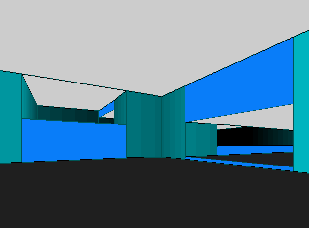

# SuperWolf

## Features:

* Multiple sectors with different floor ceiling heights
* Collision detection
* Sector transition detection

## TODO:

* Full depth shading
* Texturing
* Map parsing
* Map editor
* Light mapping
* Fun stuf: weapons, monsters, etc.
